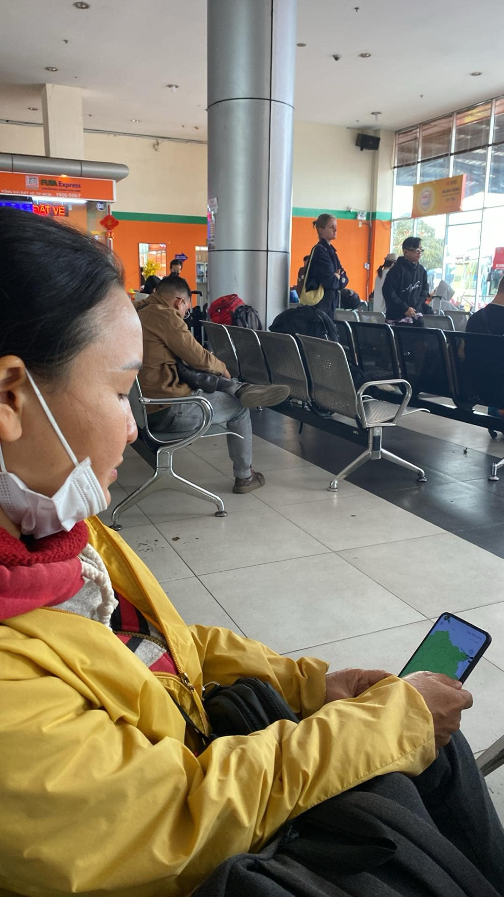
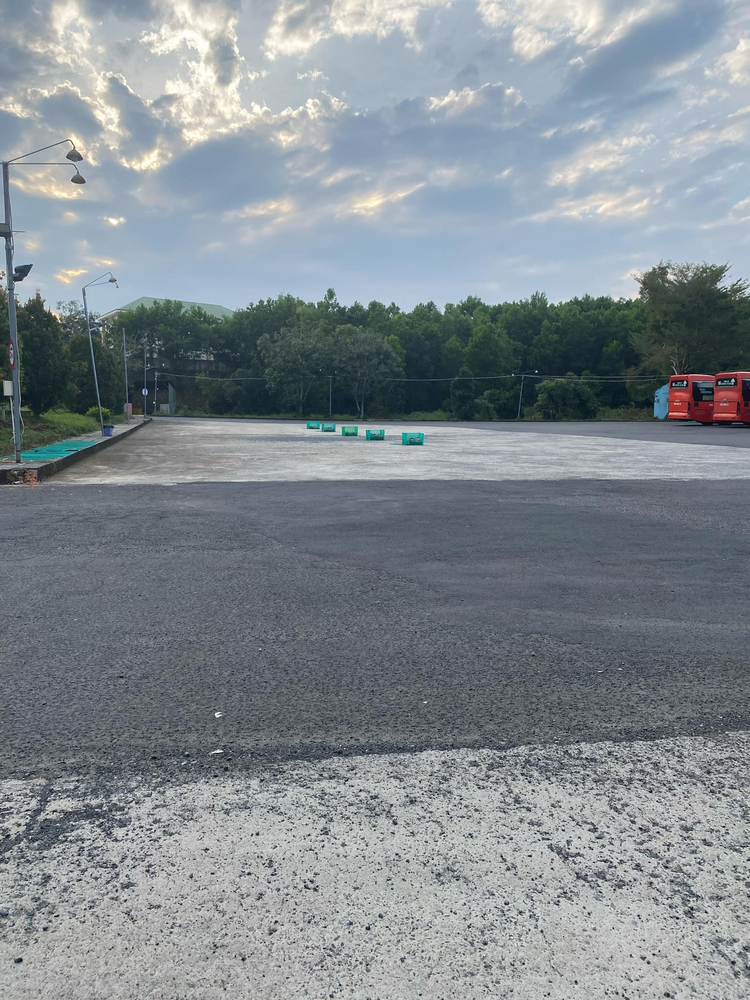
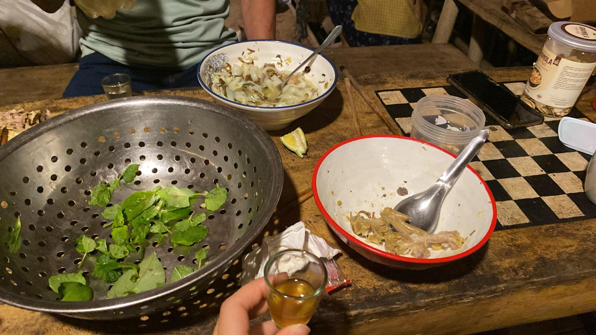

And so I've decided to go to Stone Hill Farm (Vietnamese: Đồi đá) for 2-3 months. The number of days which I stay is still a source of anxiety for me, but I'll let future me decide that. For now, let's write for fun only.

# 1. On and on, coach to coach

I've decided to take Thu - the manager of the farm, advice to take 2 coach. This means I gonna spend an extra 400k for both mom and me, but we wil get there in the afternoon. (There is the option of taking 1 coach but I will get to the farm at 2 AM, which I think is not favourable for all involved)

Dad and sis came to see us off, which is nice. (Love you sis)
And so, 7AM, the first coach came. I thought I will be able to do things when I got on the coach but I actually felt pretty sick, which was rare. I was left with no choice but to sleep the whole trip (which totally wreck my sleep hormon system I'm sure).

And so we got to Da Lat. I rested for a bit, and I snapped a picture of mom playing my (our) game. She seems to like it (omg I'm so happy).
<!--  -->

Oh and I could say that I've been to Da Lat now (for 1 hour).

I slept the majority on the second coach too. At the last of the trip, I realized something. 
So you know when every coach have that the rack full of slipper right?
Well, I never notice how the set up that so fast untill now. 
Behold: 

Notice anything?
That'st right. They pre-set all of those up. So when a coach come they just have to park at the exact spot, and everything is already in place. 

Oh yeah and the view was pretty sweet (I was feeling too sick to enjoy it though)

# 2. Finally, sweet mother earth

We arrived at Tan Phu, Dong Nai at 5PM. There was a flashy-looking dude offer to take us to our destination. He was wearing many (fake looking) gold rings and was definately suspicious, but the people around seems to know him so I decided we could trust him. (I think I can take him if he do anything funny. Luckily this is still not the day reality wakes me from my power fantasy - because it would be an expensive lesson indeed). The dude turned out to be super nice and even offer to take up the the gate of the farm and did ask for any money. He also work in durian trading - suprisingly. Mom got a new connection now (I hope it's a fortunate one)

The thing that suprises me the most was that there are a lot of durians grown here. Hill after hill, people are turning the landscape to a durian exclusive land. And they are grown quite close to each other too. 

I wonder what will happen if the durian price go down. A lot of this growth feel unsustainable, it frighten me. 
# 3. We're here

We were treated with mì quảng for dinner. Everyone was super nice, but I was too tired at that point to be totally concious. There were so much chicken in the mì quảng, I got to try cocao wine (it tasted sweet - which was okay), and I washed the dishes. 

Other things happened, but I'm to tired to care now.

We were lead to our sleeping place. Mom and I took a shower and now, it's resting time.
Actually, it's loneliness and anxiety time. Haiz. 

# 4. Anxiety
I'm actually writing this first because well, I'm still full of anxiety. Well, maybe just a bit.

First of all, I can't believed I actually took mom with me. But I did. What I wanted to show her was how people do organic farming, and I really hoping that the people here will do a good job giving her a good representation. A step closer to somehow releasing my parents from the way they do farming now - will with pesticide and chemical I don't know - a step away from the future I fear. But I'm not sure if this is a good move. Will this actually change mom's perspective? Even so, how will it changes dads? Unless a miracle appear I won't be able to stop my parents exposing themselves to potentially toxic chemical this year. Dad's question still linger: Who will buy organic durian/produce? 

Oh and I haven't look into how mom will get back to DakLak. Ahh another source of anxiety.

Next off, how will I keep in touch with my friends? I suppose I should let the relationships face the challenges to come, but I'm also a little bit worry. (I hope I'm not the only one trying to keep the relationship... I'm probably just overthinking things)

And about money. I haven't find a job yet. I really really hope I will find 1 soon, or else :"(

Lastly, I hope I won't miss out on opportunities when the labour market opens up again. I'm not sure if the AI boom is going to leave me behind. Haiz... simply put, I hope taking a 2-3 months break won't effect my ability to get a job in my field in the future. (But I'm afraid it will. irrationally, though)

This last section is written for you - me of the next 3 month. I hope you'll be able to tell me a favorable response. 

# 5. Hope 

Have some. 

