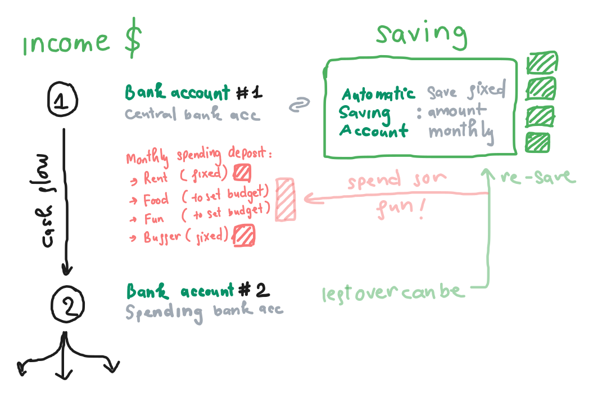

I was the type of person who is afraid of money, so for the first time in my life - when I can spend my money freely, I started incredibly conservative. I would record all my transaction (even the mini tiny ones), make sure I only spend when it's necessary, and *fun money* always means *guilt money*. As I move through life, I get more tired and paranoid of my own attitute toward money. One days, I stopped everything and let loose. I went to the other extreme. I didn't spend a whole lot of money at that time - I learned that I don't have a lot of material desire - but it was eye openning as to how easy it is to spend recklessly. I spent more time to think about finance, but with more emphasis on the system. 

There is financial framework existed for a long time. Banking and other means of transaction, saving, investing - things that people have been doing for more than 2000 years (the first metal coin was created around 650 BCE). But I didn't know about any system for individuals to do it - manage their own finance - well. 

Why?

> I'm getting side track a little bit but my hypothesis would be that it's easier to have control when you keep people ignorance (in old time). Perhaps that toolkit (personal finance management) is too valuable. Or perhaps because it's complicated and very much depends on the person - just like nutrition. Either way, it's dissapointing to me that I am not taught about finance and how to manage my own in school.

Long story short, I started to pay more attention to how I would design my personal finance system. That system must have the following qualities:
- Reliable: I know where all of my money went
- Low-mantaince: I won't spend more than 10 minutes/day for the system
- Enabling: I should feel easy to save/invest 

Curious? This is how it works (very simple):

Set up:
- Make two bank accounts (from 2 banks. Choose trust-worthy banks!).
- Central bank account (the bank account that will receive your monthly income. Prefferably with high saving intersts): Set up a automatic saving account in your central bank account. (I chose to save a fixed ammont monthly).
- Secondary bank account: Set up monthly budget and automatic month deposit (or you can do it manually) from central bank account to secondary bank account.

**Hard rule**: Only use the money in your secondary bank account and **never** use your central bank account for spending!!!

I've been trying this system out (before going no-money when I went to the farm) and it works great. As long as follow the hard rule, the system is build to support me and I feel safe that I am building a dependable financial ground for myself. 

(No investment yet because I don't have a lot of education on this front).

